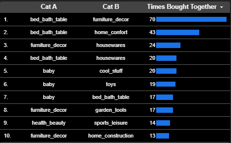

# 🛒 Brazilian Olist E-Commerce Analytics: Executive Sales, Cohort Retention, RFM & Market Basket Analysis

An end-to-end data analytics project analyzing **96k+ Brazilian e-commerce orders** from Olist (2016–2018). Built with **Google BigQuery (SQL)** for data warehousing, cohort modeling, RFM customer segmentation, and market basket affinities, presented in an interactive **4-Page Looker Studio Executive Dashboard**.

---

## 📌 Executive Summary & Key Business Findings

* **The Retention Dilemma (One-and-Done Business Model):** The 20-month cohort retention analysis indicates a steep drop-off after the initial transaction, with an average Month-1 ($M_1$) repurchase rate hovering around **0.2%–1.0%**. Olist acts primarily as an acquisition channel rather than a recurring customer ecosystem.
* **Geographical Sales Concentration:** The southeastern states (**São Paulo, Rio de Janeiro, and Minas Gerais**) account for over **60% of total GMV (R$ 13.22M)**, representing the primary regions for fulfillment routing and carrier optimization.
* **RFM Customer Segmentation:** A substantial share of the customer base falls into *At Risk* (~22k customers) and *Lost / Hibernating* (~15k customers) segments due to high recency days, while *Champions* and *Loyal Customers* drive steady, high-value revenue.
* **Market Basket Affinities:** Cross-selling analysis revealed that **Home & Living** (`bed_bath_table` + `furniture_decor` with 70 joint orders, and `bed_bath_table` + `home_comfort` with 43 joint orders) represents the strongest cluster for dynamic cart bundling.

---

## 📊 Interactive Looker Studio Dashboard Architecture (4 Pages)

### 1. Executive Overview & Sales Performance
* **High-Level KPIs:** Total Orders (**96,478**), Average Order Value (**R$ 137.04**), Gross Merchandise Value (**R$ 13,221,498.11**).
* **Time-Series Analysis:** Monthly dual-axis evolution comparing order volume vs. gross revenue (Dec 2016 – Aug 2018).
* **Geospatial Intelligence:** Regional density map mapping total revenue across all Brazilian states (ISO 3166-2).

---

### 2. Customer Cohort Retention (Matrix View)
* **20-Month Triangular Retention Matrix:** Complete cohort retention pivot table tracking customer repurchase behavior from month $0$ to month $20$.
* **Decay Tracking:** Visualized with conditional heatmap formatting for quick identification of active customer cohorts.

---

### 3. Customer Cohort and Retention (RFM & Decay Analysis)
* **Retention Curve:** Time-series decay showing the retention drop-off across relative month numbers.
* **RFM Customer Distribution (Treemap):** Proportion of user base categorized into *At Risk*, *Lost / Hibernating*, *Loyal Customers*, *Champions*, *Recent / New Customers*, and *Potential Loyalists*.
* **Segment Volume vs. Revenue (Grouped Columns):** Total customer count vs. Total revenue contribution per segment.
* **Behavioral Matrix (Scatter Plot):** Average Recency (`recency_avg`) vs. Monetary Contribution (`monetary_pct`) with dynamically sized bubbles.

---

### 4. Market Basket Analysis
* **Product Affinity Ranking:** Top 10 co-purchased category pairs sorted by frequency (`times_bought_together`), highlighting cross-selling combinations in Home Decor and Baby/Toys categories.

---

## 🛠️ Tech Stack & Architecture

* **Cloud Data Warehouse:** Google BigQuery
* **Data Transformation & Modeling:** Standard SQL (CTEs, Window Functions `NTILE()`, Self-Joins, `COALESCE`, `DATE_DIFF`)
* **Business Intelligence & Reporting:** Looker Studio
* **Dataset:** Olist Public Brazilian E-Commerce Dataset
